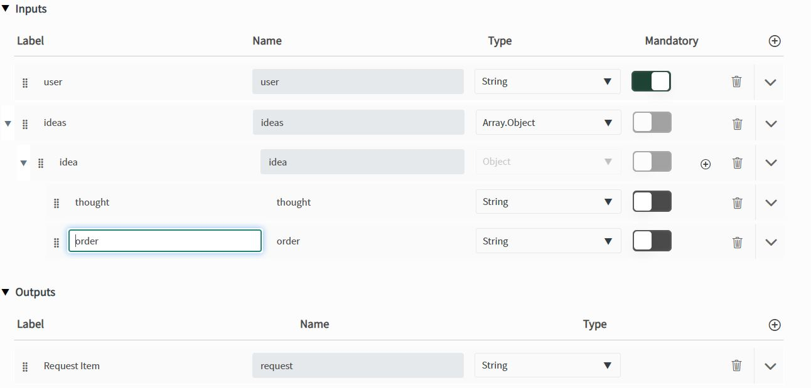
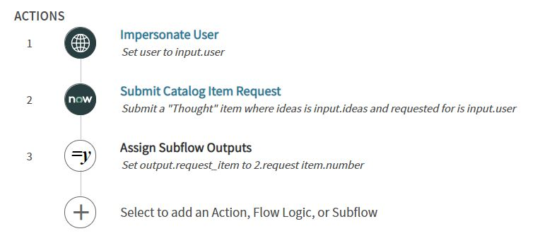

# Success with Flow Designer

Here's the requirements that drove this post.

✅ Create a catalog item (I can do this every day)\
✅ Add a MRVS (easy peasy lemon squeezy)\
✅ From a service account (sure, but MRVS and the cart api might be weird)\
✅ As someone else (sure, `gs.impersontate` never hurt right)\
🛑 Without admin role (Um, I'm not sure about the impersonate bit)

This seemed like something simple at first.  I created a item to track my thoughts.  It had one variable set on it called "Ideas".  That variable set had two variables in it `thought` and `order`.  I'm always thinking and needed something to test against.  

I was told the older cart api didn't seem to work with the MRVS.  I didn't try it I went straight for [CartJS](https://developer.servicenow.com/dev.do#!/reference/api/paris/server/sn_sc-namespace/c_CartJSScoped).

First attempt was showing this is possible from a fix script like so;

```js
var impUser = new GlideImpersonate();
impUser.impersonate('someUserSysId')
var cart = new sn_sc.CartJS();
var request = {
  'sysparm_id': '2edaaaec2f31e090bd54d5f62799b62b',
  'sysparm_quantity': '1',
  'variables':{
    'ideas': JSON.stringify([
      {
        thought: "This is a thought", 
        order: "100"
      }
    ])
  }
}
var cartDetails = cart.orderNow(request);
gs.info(cartDetails);
```

That worked but, then he brought up the issue of race conditions were multiple requests would come in at the same time.  Before the problem was it would submit and work, but it would checkout as the wrong person in some cases.

This new problem needed a new solution.  

Generally when you have race conditions, one way to solve this is to create a queue of sorts.

I suggested the tried-and-true method of using event queue and script actions to deal with this.  But, that seemed more complicated.  

# Enter Flow Designer

I have not been a fladvocate.  It's a new year.  I thought I'd give it a go and you know what.  Flow Designer suprised me by how well it worked*.  I'll walk through those steps.  For you professional fladvocates, this old news.

High level of what I did.  I knew I needed a subflow so I could call it from my scripted endpoint.  


## Create Flow Designer Action "Impersonate User"

You'll need to set up the input to take a user.  That's it.

```js
var impUser = new GlideImpersonate();
impUser.impersonate(inputs.user);
```

## Created a Subflow

I created a subflow.  This subflow, needed a input of `user` and a input array for the `multirow variable set`. 

- Create the inputs and outputs
  
- Add the "Impersontate User" action.\n
- Add the Create Catalog item action.
- Add Assign Subflow Outputs
- Connect the pills appropriately.
- Publish the subflow
  
- In the verticle elipses (aka the thin hamburger \[top right of screen\]), click the "Code Snippets" button.  Copy that text.

## Create your scripted rest api

In here you're going to match up the data to the subflow like so.

```js
(function process(/*RESTAPIRequest*/ request, /*RESTAPIResponse*/ response) {

  //expect person to request for 
  //expect array for mvrs
  var user = request.body.data.user;
  var thoughts = request.body.data.ideas;
  var now = new Date();
  (function() {
    try {
      var inputs = {};
      inputs['user'] = user; // String 
      inputs['ideas'] = thoughts; // Array.Object 
      var result = sn_fd.FlowAPI.getRunner().subflow('global.request_item_for_person').inForeground().withInputs(inputs).run();
      var outputs = result.getOutputs();
      var request = outputs['request']; // String
      response.setBody(outputs)
    } catch (ex) {
      var message = ex.getMessage();
      gs.error(message);
    }
  })();
})(request, response);
```

## Test the REST

Testing the rest worked great.  Here's the rest body and response;

https://dev16718.service-now.com/api/8821/item

```json
{
	"user":"ca826bf03710200044e0bfc8bcbe5d89",
	"ideas": [{
		"thought": "Jace says adios baby!", 
	  "order": "100"
	}]
}
```

```json
{
  "result": {
    "request": "RITM0010017"
  }
}
```

\* I still think the UI is confusing but, I don't have feedback to fix it.