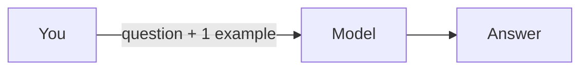
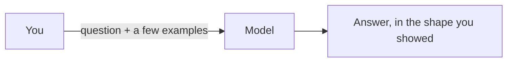
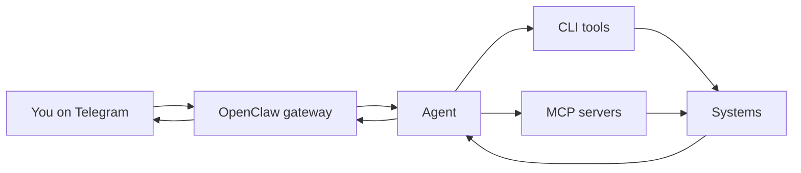
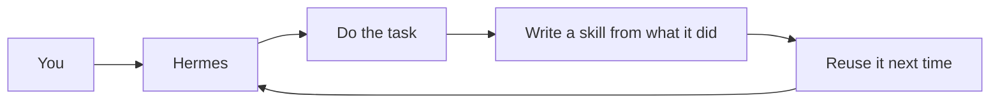
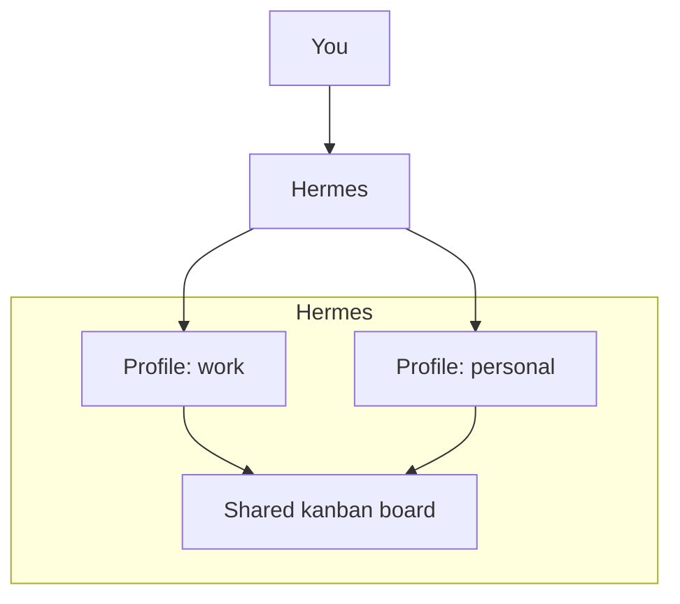
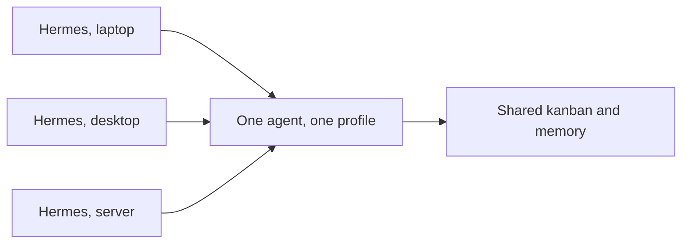
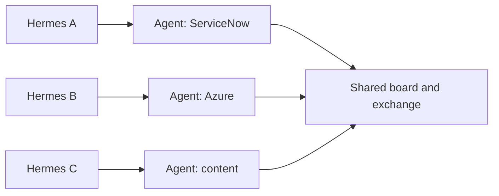
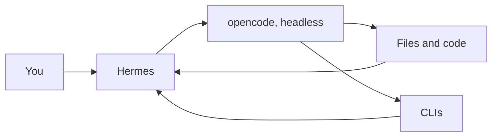
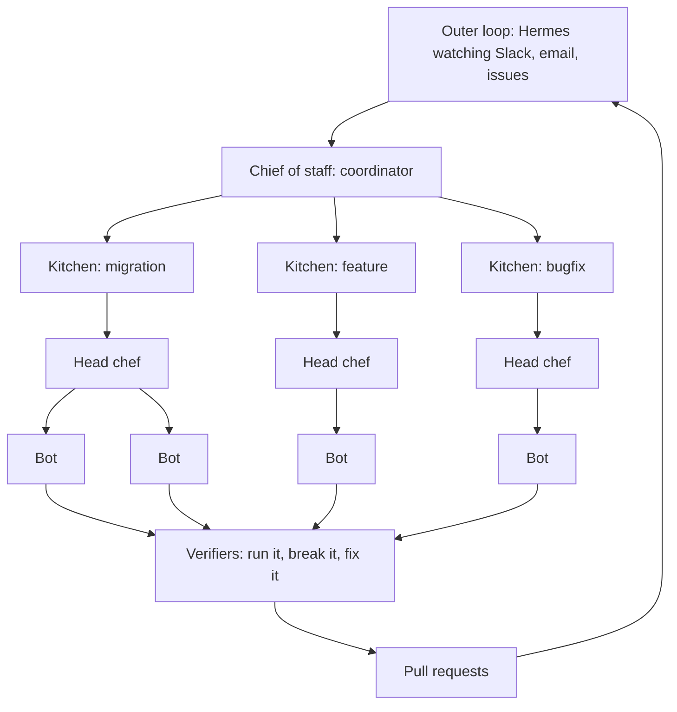

I wrote up the history of the AI patterns I have used. A few people asked what the later ones actually look like, and honestly, diagrams explain them faster than paragraphs.

So here they are, in roughly the order I hit them. Same idea as the history post, just drawn.

## 1. One-shot

One example, then your question. The model follows the shape of the example.

## 2. Few-shot

Same thing with a few examples. This is the one that fixes consistency, and it is still the highest-leverage trick in a chat window.

## 3. OpenClaw, reached through Telegram

The agent lives where you already are. You message it, it runs tools, it answers. This is the pattern I wanted and never got stable.

## 4. Hermes, writing its own skills

Hermes does a task, then writes a skill from what it did. Next time it reuses that skill instead of figuring it out again, and it does it the way you did.

## 5. Hermes with multiple profiles and a kanban board

Different contexts stay separate, and the work stays visible on a board instead of buried in one long conversation.

## 6. Many Hermes, one agent

Multiple machines, one agent and one profile behind them. Same instructions everywhere, shared state.

## 7. Many Hermes, many agents

Now the agents are specialized. One for ServiceNow, one for Azure, one for content, all feeding a shared board.

## 8. Hermes calling opencode

When the work is code, Hermes hands it to opencode headless and gets back real changes.

## 9. The kitchen (Poteto-style orchestration)

This is the one I am building toward. It comes from Lauren Tan's (Poteto) orchestration work with [pstack](https://github.com/cursor/plugins), and she explains it with a Michelin-kitchen metaphor. Once you are the chef, you are not cooking every dish. You are running the kitchen: ordering ingredients, storing them, deciding when they get prepared, and handing out the work. The environment, the skills, and the codebase are the new ingredients.

The roles map like this:

- A **chief of staff** is a coordinator agent. It does not write code itself. It
  takes a batch of issues, picks the right topology, and spawns sub-agents to do the work.
- A **head chef** runs one workstream and directs its own bots.
- **Verifiers** check the work by running the app, clicking around, and looking
  for regressions, then fixing what they find before it lands.
- The **outer loop** watches the world (Slack, email, issues) and feeds new work
  in.

In my case, Hermes is the outer loop. It observes, collects issues and data points, and eventually hands a batch to a chief of staff who spins up a kitchen.

The human part is the part I like most. At that scale you cannot taste every dish, so you sample instead. You watch how the agents fail, and every repeated mistake becomes a constraint in the environment so it cannot happen again.

If you want the source idea, Matt Pocock talked with Poteto about it here: [LIVE: Poteto on shipping 1,000s of PRs a month at SpaceX](https://www.youtube.com/watch?v=MN9dGgmLyso).

## Why this matters

Every one of these is the same move: get the model closer to the work, and get me further from the loop. One-shot to few-shot to tools to agents to a kitchen is all one direction.

The diagrams are the whole point of this post. If a pattern is hard to draw, it is usually hard to use, too.
